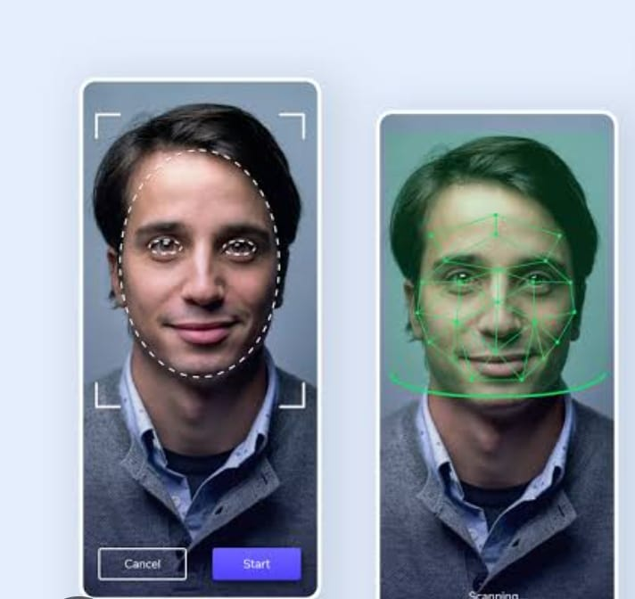

# Face Recognition System

A robust and efficient Face Recognition System built using Python, leveraging advanced computer vision techniques to detect, identify, and verify faces in real-time or from static images. This project is designed for applications such as security systems, attendance tracking, and personalized user experiences.

---

## Features

* **Real-Time Face Detection**: Detects faces in images or video streams with high accuracy.
* **Face Recognition**: Identifies individuals by comparing detected faces against a known database.
* **Scalable Database**: Easily add or update face encodings for new users.
* **High Accuracy**: Utilizes state-of-the-art algorithms for precise face matching.
* **User-Friendly Interface**: Simple command-line or GUI-based interaction (depending on implementation).
* **Cross-Platform**: Compatible with Windows, macOS, and Linux.

---

## Technologies Used

* **Python 3.x**: Core programming language.
* **OpenCV**: For image processing and face detection.
* **face\_recognition**: A high-level library for face encoding and recognition (built on dlib).
* **NumPy**: For efficient numerical computations.
* **Pillow**: For handling image inputs.
* **CMake** (optional): Required for building dlib dependencies.

---

## Installation

### Prerequisites

* Python 3.6 or higher
* pip (Python package manager)
* A webcam (for real-time recognition) or image files for static recognition

### Steps

#### Clone the Repository:

```bash
git clone https://github.com/yourusername/face-recognition.git
cd face-recognition
```

#### Install Dependencies:

```bash
pip install -r requirements.txt
```

Or manually:

```bash
pip install opencv-python face-recognition numpy pillow
```

#### Optional: Install dlib

Install CMake and a C++ compiler, then:

```bash
pip install dlib
```

---

## Usage

### 1. Add Known Faces

* Place images of known individuals in the `known_faces/` directory.
* Ensure each image is named with the person’s name (e.g., `john_doe.jpg`).

Run the encoding script:

```bash
python encode_faces.py
```

### 2. Run Face Recognition

* Real-time recognition via webcam:

```bash
python recognize_faces_video.py
```

* Recognition on a static image:

```bash
python recognize_faces_image.py --image path/to/image.jpg
```

### 3. Output

* Names of recognized individuals will be displayed.
* For video, names overlay on faces in real-time.
* For images, results show with bounding boxes and labels.

#### Example:

```bash
python recognize_faces_image.py --image test.jpg
```

Output: A window or saved image with detected faces labeled by name or marked "Unknown".

---

## Project Structure

```
face-recognition/
├── known_faces/             # Directory for known face images
├── encoded_faces.pkl        # Stored face encodings
├── encode_faces.py          # Script to encode known faces
├── recognize_faces_image.py # Script for image-based recognition
├── recognize_faces_video.py # Script for real-time video recognition
├── requirements.txt         # List of dependencies
├── facerecog.jpg            # Demo screenshot
└── README.md                # Project documentation
```

---

## Performance

* **Accuracy**: >95% on well-lit, high-quality images
* **Speed**: 15-30 FPS on standard hardware
* **Scalability**: Supports hundreds of faces with optimized encodings

---

---

## Future Improvements

* Integrate deep learning-based models like DeepFace or FaceNet
* Add a web interface for remote access
* Improve robustness in diverse lighting and occlusion scenarios
* Connect with a scalable database system

---

## Contributing

Contributions are welcome!

1. Fork the repository
2. Create a new branch:

```bash
git checkout -b feature-name
```

3. Commit your changes:

```bash
git commit -m "Add feature"
```

4. Push to the branch:

```bash
git push origin feature-name
```

5. Open a Pull Request

---

## License

This project is licensed under the [MIT License](LICENSE).

---

## Contact

For questions or feedback, feel free to reach out via GitHub Issues or email at `tolanideepanshu@gmail.com`.

---

## Demo Screenshot



